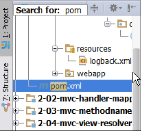

# 第一章 快速了解你的IDE

本章节，我们将会比较IntelliJ IDEA 各个版本以及它们的许可范围之间的差异，安装，以及快速的浏览一下它主要的工作区。IntelliJ IDEA 自带的设置非常多，本书只会介绍我们常用的一些设置。详细的主题如下：
* 不同版本的比较
* 安装
* 工作空间的概述
* IDE 设置
* 配置提示及技巧

### 不同版本的比较
IntelliJ IDEA 目前有两个可用的版本，一个是免费的社区版，另一个是全功能的旗舰版。你可以使用它们其中任何一款用作开发你的商用软件。值得一提的是，新版的 Android Studio(一款用于开发Android 应用的IDE) 也是基于IntelliJ IDEA。

如果你想了解更多的比较细节，请移步到JetBrains 官网：<code>http://www.jetbrains.com/idea/features/editions_comparison_matrix.html</code>。简而言之，社区版会少很多功能。但是，也可以使用一些小技巧来超限的使用某些没有的功能。例如，当你不想花钱(只能用社区版)，你又使用类似Tomcat或者Jetty之类的 WEB 容器的时候，该怎么办呢？(社区版是没有包含这些功能的)你可以使用 Maven 插件(Tomcat/Jetty)来运行或调试你的 WEB 应用。更多的细节，我们会在第五章《美梦成真-运行你的项目》里重点介绍。如果你想先一睹为快，也可以翻到相关的章节去查阅。

你可以使用社区版里自带的框架(诸如，Play、Struts、Spring等)去开发您的应用。但是，不会提供额外的辅助。例如，大多数的配置提示、警告、自动补齐和动态配置检测都将不可用。

与之相反，旗舰版是一个全功能的商用版本。它基本上支持所有时下最新的框架和应用服务器。它的辅助功能(代码提示、补全等)应该是现在IDE里做的最好的。并且提供更全的语言特性支持。例如，你可以获得HTML和SCRIPT语言的动态分析功能。

除了上述的功能外，旗舰版的许可也做了分类。根据你的需要，你可以购买下面任意的许可：
* **商业许可**：公司里任意的开发人员都可以使用，但是同时在线的人数不能超过购买许可允许上限。
* **个人许可**：可以用在多台电脑上，只允许一台在线。对开发的内容没有限制。

此外，针对某些特定的用户，如，创业公司、学生、老师、教育或培训以及开源项目，以上的这些特定的人群，会有一些可选的折扣许可。

> 如果您打算购买旗舰版，建议你可以在一些重大节日(如：圣诞节、复活节等)的时候再下手。因为这个时候，JetBrains 公司通常会推出一些庆祝类的折扣活动。

### 安装 IntelliJ IDEA
IntelliJ IDEA 的安装非常简单。执行如下步骤就可以了：
1. 到IntelliJ IDEA 的官网：<code>http://www.jetbrains.com/idea/download/</code>。
2. 根据自己的需要，选择相应的版本(操作系统和软件版本)。
3. 当下载完成后，如，在微软的window上，当你运行安装程序后，会出现安装向导，跟着向导的指引，很轻松的完成安装；在苹果Mac OS上，双击<code>.dmg</code>文件，之后只需将IntelliJ IDEA 拖到<code>Application</code>文件夹中即可。

> 当你在已有的电脑上再安装IntelliJ IDEA时，安装向导将会询问你是否导入之前版本中的设置。

安装好后，在第一次启动IntelliJ IDEA时，它会询问你开启缺省的插件，建议仅开启你需要的插件，这样可以提高IDE的运行效率。如果你不知道如何选择，也不必太过于担心。通过编辑IDE的<code>Setting</code>你可以随时启动或关闭。

### 工作空间概览
IntelliJ IDEA 的工作空间由主编辑选卡、菜单和一些工具窗口组成。

### 工具窗口(Tool windows)
在13及以上的版本里，默认情况下，工具窗口是处于隐藏状态的。你可以单击工作空间左下角按钮切换它的状态：


工具窗口一般都是吸附在工作空间边缘的那些小选卡，而承载着这些工具窗口的边缘称之为工具窗口栏，如下截图所示：

 

有些工具窗口总是处于激活状态，例如：<code>Project</code>和<code>Structure</code>，有些仅在相应的插件启动后才会被激活。你也可通过鼠标的拖拽来重排它们的顺序和位置。


> 在工作空间的顶部，是第四个工具窗口栏条，默认情况下，它是一直处于隐藏状态。仅当拖拽的工具窗口悬浮在它上面时，才会被激活，供工具窗口使用。如下图所示：


### 工具窗口的视图模式
当你右击任意一个工具窗口时，会激活以及关联的上下文菜单。上下文菜单中包含的选项对于不同的窗口会有所差异，但是几个窗口模式一般都有。如下图所示：


### 固定模式(Pinned Mode)
当工具窗口开启了<code>固定模式</code>后，那么它会一直显示在工作空间中(不管是否处于激活状态)。就<code>Project</code>工具窗口来说，你可能更加喜欢一直显示它，以方便浏览项目的结构。固定模式依赖下面即将要出场的<code>停驻模式</code>。当然，你也可以选择一直关闭它，使用一些快捷键去查找。在大型的项目里，这种方式相对你手动在文件树中查找更有效率。

### 停驻模式(Docked Mode)
当<code>停驻模式</code>开启时，工具窗口会与工作区里的其他元素(如：编辑器[Editor])共享整个空间。反之，当工具窗口被激活时(获取焦点时)，会覆盖在其他工作空间元素的上面，相反，它会被隐藏。这种模式在某些场景下是非常有用的。例如，当你查看控制台(console)输出或阅读一个大的日志文件时。

### 浮动模式(Floating Mode)
<code>浮动模式</code>，顾名思义。让工具窗口跳出工具栏条的束缚，悬浮在工作空间上方。在多重监听环境下，这种模式显得尤为强大。至于你想让多少个工具窗口同时处于<code>浮动模式</code>,现在没有做任何限制。而且处于这种模式下，窗口的重排变得更加随手可得了。

### 分隔模式(Split Mode)
当工具窗口开启这种模式，其会与其他的工具窗口共享工具窗口栏。这样你就可以很轻松同时查阅两个(或以上)的工具窗口内容。正如下图所示，你可以很轻松地同时查阅<code>项目结构</code>和```文件结构```两个窗口内容：


当时对工具窗口之间的分割器使用```Ctrol+单击```(PC)或```cmd+单击```(Mac)快捷键时，```IntelliJ IDEA```会将它们切换成水平布局的宽屏模式，既水平并列的显示。这种模式特别适合使用大屏工作场景，如果你是一个对显示空间利用率有极致要求的开发者，真是喜闻乐见了。如图所示：


> 通过```Alt(PC)```或```cmd(Mac)```和工具窗口名字前面的助记符数字快捷键，你可以快速切换到指定的工具窗口。例如，使用```Alt+1(PC)```或```cmd+1(Mac)```组合快捷键，你可以很优雅且快速的切换到```Project工具窗口```。同理，当你想要隐藏它的时候，按多一次即可。

### 工具窗口的视图
某些工具窗口拥有多个可用的视图。例如，```Project工作窗口```，它可以切换为```Project```、```Packages```、```Problems```等视图，如下图所示：

   

当然，如果你喜欢，你也可以勾选菜单上下文中```Show views as tabs```，这样它们就可以分选卡并排的显示。如图：


> 译者注：上述的功能，在2015版以后，改成了```Group tabs```,使用这些版本的小伙伴注意了。

当你对工具窗口进行了一些个性化的设置以后，建议你备份一下当前的布局。可以使用主菜单中```Window|Store Current Layout as Default```完成设置的备份。这样，什么时候你想恢复到当前的备份，只需使用主菜单的```Window | Restore
Default Layout```操作或按```shift+F12```组合快捷键即可。

通过```F12(PC)```或```Fn+F12(Mac)```快捷键，可以快速打开最后一次激活的工具窗口。如果你希望在Mac机上这个动作生效，需要先在系统预设窗口中调整一下F12的系统行为。```Ctrol+Shift+F12(PC)```或```cmd+Fn+Shift+F12(Mac)```快捷键可以让工具窗口在显示和隐藏之间快速切换，并让焦点回到编辑器(Edditor)中。

> 按```Esc```键，总能让焦点回到编辑器中。

当工具窗口切换为关闭状态时，连按左```Al```t键(PC)两次或按住左```cmd```键(Mac)不放，可以临时打开工具窗口。这样，你可以快速切换到工具窗口且可以节省屏幕空间。

### 工具窗口内部导航
如果工具窗口包含一个列表(大多都是这种情况)需要导航或检索，只需将焦点切回到工具窗口内部，输入需要检索的关键字即可。不管在```Project```或其他的工具窗口中，都可以使用这用方式。可以根据输入的字符实时的过滤出你想要检索的内容。如图所示：


### 为项目设置个性化的工具窗口布局
在IntelliJ IDEA插件仓库中有一个非常有用的工具窗口管理插件，它的名字叫```ToolWindow manager```。关于插件的更多的细节，我们将在稍后讲解。这个插件有什么牛逼的地方呢？默认情况下设置都是全局的，没有办法为每一个项目做个性化定制(eclipse 天生支持)。答案很明显了，这个插件就是肩负这样的使命。让你可以为每一个项目设置个性差异的工具窗口布局，从而使得你的IDEA的设置变得更加简洁。

如何设置呢？前提你先到IDEA的仓库中搜索并安装它。按照```Window|Configure Preferred Availabilities```操作路径打开配置对话框。如图所示：


接着，根据项目或自己的偏好为每个工具窗口设置参数。选择```Hide```参数相应的工具窗口会被隐藏，```Show```反之，如图所示：


### 编辑器选卡(Editor tabs)
编辑器选卡是组成工作空间的重要组件。它代表着一个个被打开的文件和一个包含众多选项(如：添加一个文件到收藏夹```[Favorites]```列表或加入到版本控制系统中)的上下文菜单。

虽然选卡的使用大大简化了文件之间的切换，但是它也有缺点。当打开的文件过多的时候，它会占用大量的编辑器空间。通过设置限制选卡可显示的上限是一个折中的方法，步骤如下，```Setting|Editor|General|Editor tabs(PC)```或```IntelliJ
IDEA | Preferences | Editor | Editor tabs (Mac)```。通过上面的设置后，IntelliJ IDEA会根据你的设置参数，自动关闭超过上限的选卡。减少选卡过多造成的混乱。至于关闭那些选卡，完全由你选用的关闭策略有关，目前有两种策略，默认情况下会关闭使用频率最少，另一种是优选关闭没有修改过的文件。具体设置如下图：


另外一种做法是完全关闭选卡功能，咋一听感觉有点怪怪的，但是，当你习惯使用快捷方式去打开文件，选卡对你来说就变得不关紧要了，而且这样还能释放出更多的编辑器空间。

> 使用```Ctrol+E(PC)```或```cmd+E(Mac)```可以显示已打开过的列表。使用```Ctrol+Shift+E(PC)```或```cmd+Shift+E(Mac)```可以显示最近编辑的文件列表。你也可以使用```Ctrol+Tab```与```Ctrol+Shift+Tab```进行上述两种模式的相互切换。

### 制作你的设置(Setting) 
接下来章节里，我们将讨论关于IDE设置方面的一些主题——设置快捷键、颜色、字体和插件。
### 搜索选项
使用主菜单```File | Settings(PC)```或```IntelliJ IDEA | Preferences (Mac)```操作路径可以激活设置对话框。你也可以使用工具栏中的扳手小图标或Ctrol+Alt+S(PC)或cmd+,(Mac)快捷键激活。所有的设置可以分为两个大类，一类是针对项目的一些设置(如：代码格式、版本控制等)，另外一类是IDE全局设置(如：外观或Http代理)。

IDE的选项非常多，所幸的是我们可以使用收索栏去检索我们想要的选项。这个检索是动态的，会随着你的输入字符不断的过滤结果。例如，如果你在搜索框中输入一个"typo"时，这里会检索出针对项目设置```Inspection(检查)```和```Editor/Colors & Font/General```两个结果，在```Inspection```设置中，你可以关闭```Spelling/Typo```提示。而在```Colors&Font```部分，你可以设置拼错单词的显示颜色。
### 设置快捷键
### 颜色与字体
### 挑选你的插件(Plugins)


                          


